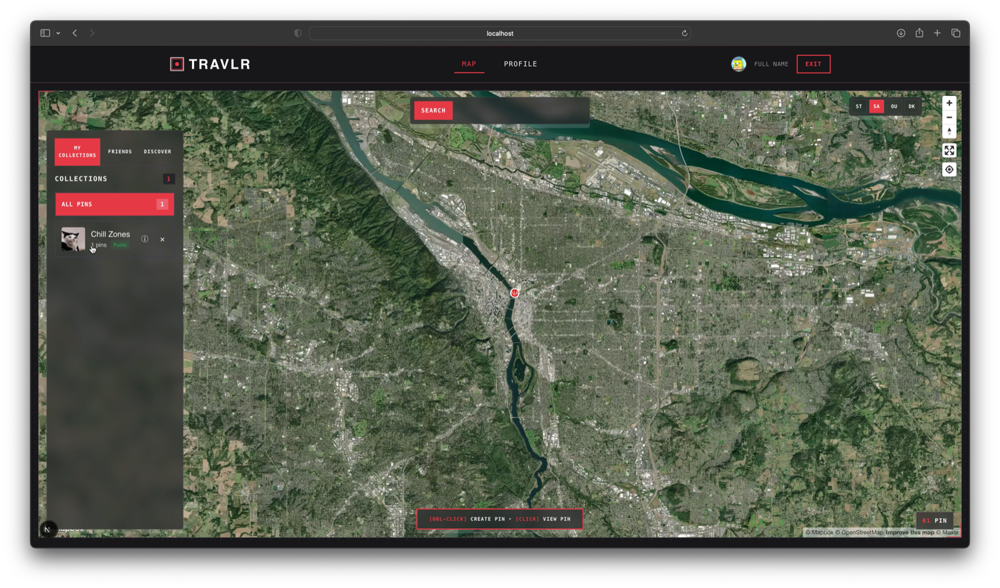
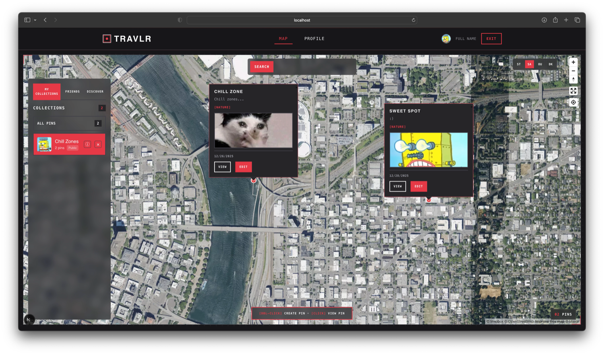

# Travlr 

Drop pins, share spots, build your perfect city guide.

<p align="center">
  
  
  
</p>

> **🚧 Currently Building**  
> Pls Don't expect everything to work perfectly (yet).

## 🎯 Save, collect, share

Drop pins on that random taco spot you found, organize them into collections like "Date Night Spots" or "Best Coffee in Portland," and share them publically.

## 🚀 Get It Running

### You'll Need
- Node.js 18+
- npm or yarn 
- A Mapbox account 
- A Supabase project 

### Setup

Clone and install:
`git clone https://github.com/hunterbeezley/Travlr.git`
`cd Travlr`
`npm install`

Environment setup:
`cp .env.example .env.local`
Fill this out with your API keys (see below)

Run it:
`npm run dev`

Open http://localhost:3000 and start dropping pins.

### API Keys Setup

Create `.env.local` with:
```env
NEXT_PUBLIC_MAPBOX_ACCESS_TOKEN=pk.your_mapbox_token_here
NEXT_PUBLIC_SUPABASE_URL=https://your-project.supabase.co
NEXT_PUBLIC_SUPABASE_ANON_KEY=your_supabase_anon_key
```

**Get your keys:**
- Mapbox: Sign up at mapbox.com → Account → Access tokens
- Supabase: New project at supabase.com → Settings → API

### Supabase Storage Setup

**⚠️ Important:** Image uploads require Supabase Storage to be configured.

Follow the detailed guide: [STORAGE_SETUP.md](./STORAGE_SETUP.md)

Quick steps:
1. Create a public bucket named `travlr-images` in Supabase Storage
2. Set up RLS policies to allow authenticated uploads
3. Test at http://localhost:3000/test-images


🛠️ Tech Stack
Framework: Next.js 15 + React 19
Backend: Supabase (PostgreSQL + Auth + Storage)
Maps: Mapbox GL JS
Styling: Pure CSS with custom properties
TypeScript

📁 Arch
```
src/
├── app/                    # Next.js app router stuff
├── components/             # React components
│   ├── Auth.tsx           # Login/signup 
│   ├── Map.tsx            # The main map interface
│   ├── PinCreationModal.tsx # Pin creation with image uploads
│   ├── ProfilePictureUpload.tsx # Profile pic management
│   └── ...more            # SingleImageUpload, MultipleImageUpload, etc.
├── hooks/                 # Custom hooks
└── lib/                   # Database services, utilities
```


