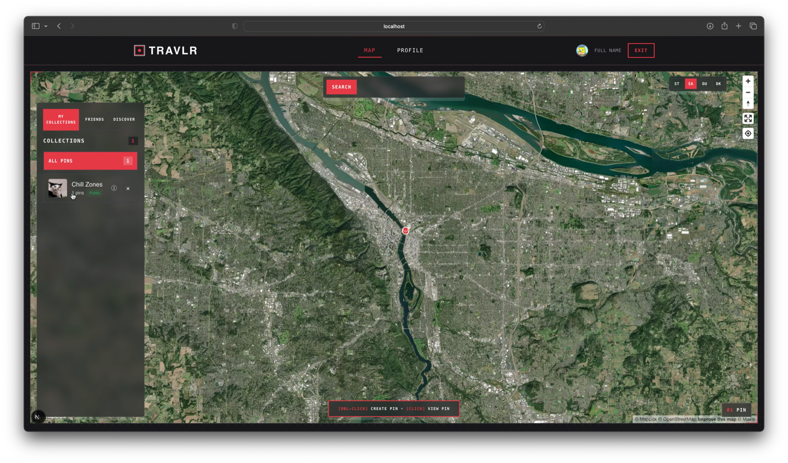
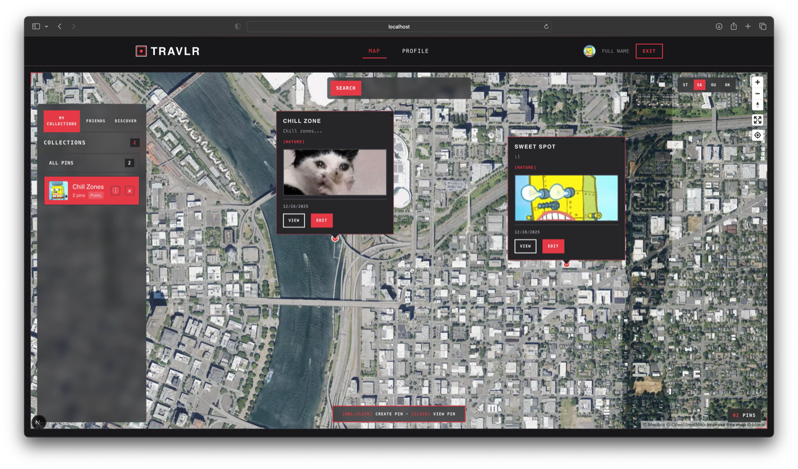
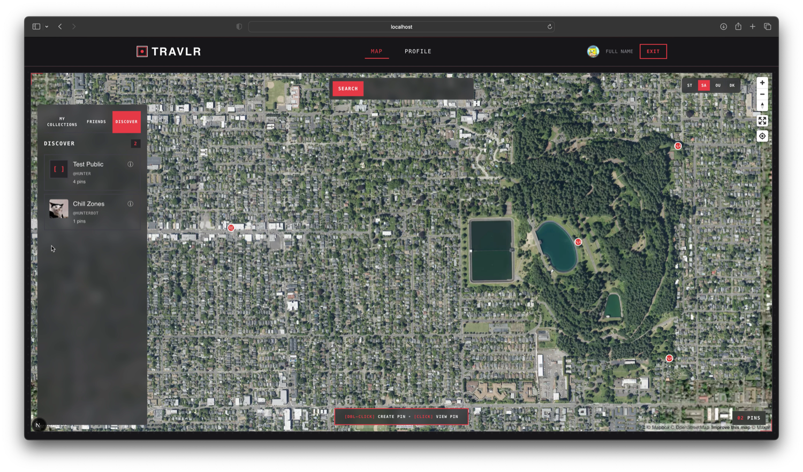

# Travlr

Drop pins, share spots, build your perfect city guide.

<p align="center">
  
  
  
</p>

> **🚧 Development Status**
> Core features complete! Social feed, authentication, and security hardening (Phase 1) are live.
> Adding voting/comments and city-based discovery feeds next. Requires legal docs before production launch.

## ✨ What Works Right Now

### Core Features
- 📍 Drop pins anywhere on the map with photos & details
- 📁 Organize pins into collections (public or private)
- 🎨 Custom collection colors (preset + hex color picker)
- 🗺️ Multiple map styles (Streets, Satellite, Terrain, Dark)
- 🔍 Google Places integration with business details, hours, ratings

### Social Features
- 👥 Follow other users and see their public collections
- 🔔 Real-time notifications for follows and friend activity
- 🌍 Social feed with friends' collections and city-based discovery
- 👤 User profiles with stats (pins, collections, followers)
- 🔍 Search for users, collections, and pins

### Advanced
- 📸 Up to 5 images per pin with image galleries
- 🏷️ 10 pin categories with custom colored icons
- 🔒 GDPR compliance (data export, account deletion, consent management)
- 🔐 Security hardening (rate limiting, route protection, input validation)
- 📱 Dark mode support

### Coming Soon
- 💬 Comments on collections ([#30](https://github.com/hunterbeezley/travlr/issues/30))
- ⬆️⬇️ Voting/rating system ([#30](https://github.com/hunterbeezley/travlr/issues/30))
- 🏙️ Enhanced city-based discovery ([#29](https://github.com/hunterbeezley/travlr/issues/29))
- 📱 Mobile UX improvements ([#26](https://github.com/hunterbeezley/travlr/issues/26))
- 📄 Terms of Service & Privacy Policy ([#21](https://github.com/hunterbeezley/travlr/issues/21)) ⚠️ Required for launch

## 🎯 Save, collect, share

Drop pins on that random taco spot you found, organize them into collections like "Date Night Spots" or "Best Coffee in Portland," and share them publicly with friends or the world.

## 🚀 Get It Running

### You'll Need
- Node.js 20+ (required for Next.js 16)
- npm or yarn
- A Google Maps API key (with Maps JavaScript API enabled)
- A Supabase project

### Setup

Clone and install:
```bash
git clone https://github.com/hunterbeezley/Travlr.git
cd Travlr
npm install
```

Environment setup:
```bash
cp .env.example .env.local
```
Fill this out with your API keys (see below)

Run it:
```bash
npm run dev
```

Open http://localhost:3000 and start dropping pins.

### API Keys Setup

Create `.env.local` with:
```env
NEXT_PUBLIC_GOOGLE_MAPS_API_KEY=your_google_maps_api_key
NEXT_PUBLIC_SUPABASE_URL=https://your-project.supabase.co
NEXT_PUBLIC_SUPABASE_ANON_KEY=your_supabase_anon_key
```

**Get your keys:**
- Google Maps: Create project at console.cloud.google.com → APIs & Services → Credentials (enable Maps JavaScript API)
- Supabase: New project at supabase.com → Settings → API

### Supabase Storage Setup

**⚠️ Important:** Image uploads require Supabase Storage to be configured.

Follow the detailed guide: [STORAGE_SETUP.md](./STORAGE_SETUP.md)

Quick steps:
1. Create a public bucket named `travlr-images` in Supabase Storage
2. Set up RLS policies to allow authenticated uploads
3. Test at http://localhost:3000/test-images


## 🛠️ Tech Stack

- **Framework:** Next.js 16 (App Router) + React 19
- **Backend:** Supabase (PostgreSQL + Auth + Storage + RLS)
- **Maps:** Google Maps JavaScript API with Places integration
- **Styling:** Pure CSS with CSS variables (no framework)
- **Language:** TypeScript (strict mode)
- **Security:** Rate limiting, route protection middleware, server-side validation

## 📁 Project Structure

```
travlr/
├── src/
│   ├── app/                    # Next.js 16 app router
│   │   ├── page.tsx           # Social feed (homepage)
│   │   ├── profile/page.tsx   # User profiles
│   │   ├── settings/page.tsx  # User settings
│   │   ├── map/page.tsx       # Interactive map view
│   │   ├── search/page.tsx    # Search interface
│   │   └── api/               # API routes with rate limiting
│   ├── components/            # React components
│   │   ├── Auth/              # Authentication components
│   │   ├── Map.tsx            # Google Maps integration
│   │   ├── Feed/              # Social feed components
│   │   ├── Collection/        # Collection management
│   │   ├── Pin/               # Pin creation & display
│   │   └── ...more            # Notifications, modals, forms
│   ├── hooks/                 # Custom React hooks
│   ├── lib/                   # Utilities, Supabase client, validation
│   └── middleware.ts          # Route protection & auth
├── migrations/                # SQL migrations & RLS policies
├── scripts/                   # Utility scripts
├── public/                    # Static assets
└── docs/                      # Documentation
```


